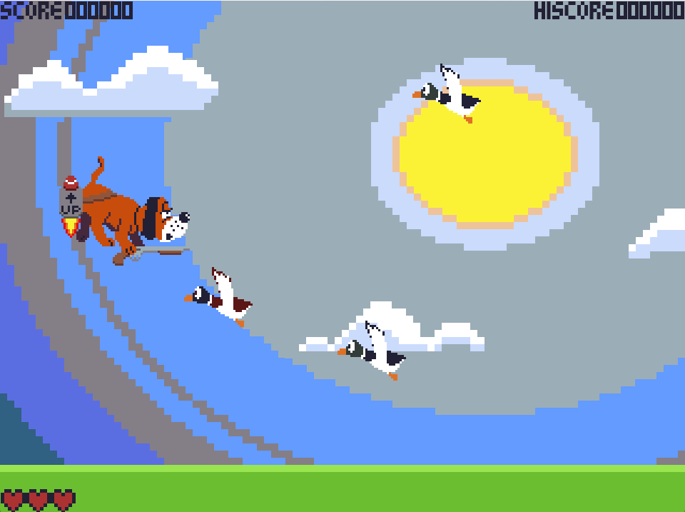
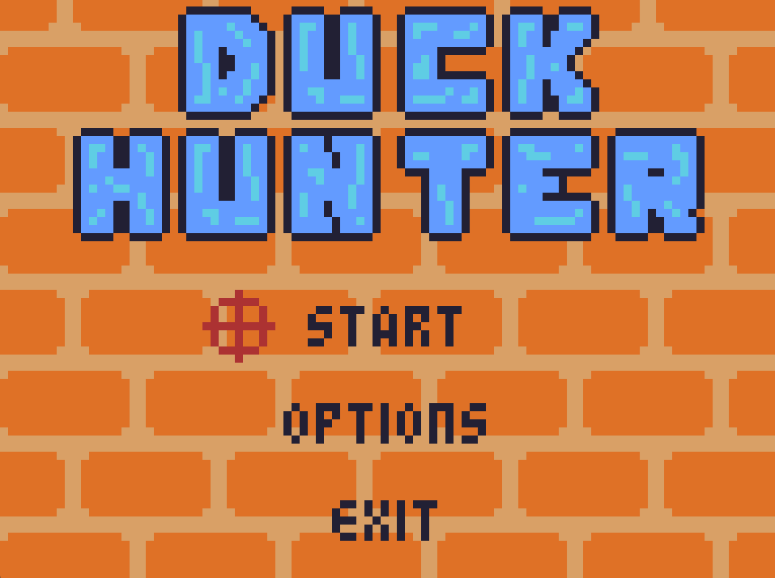
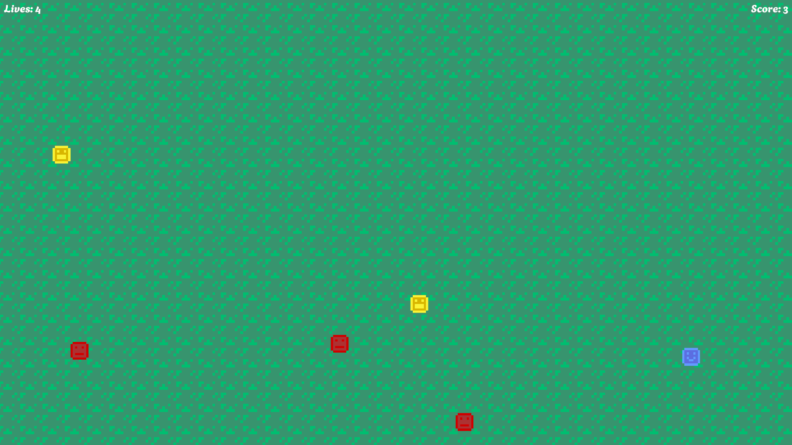
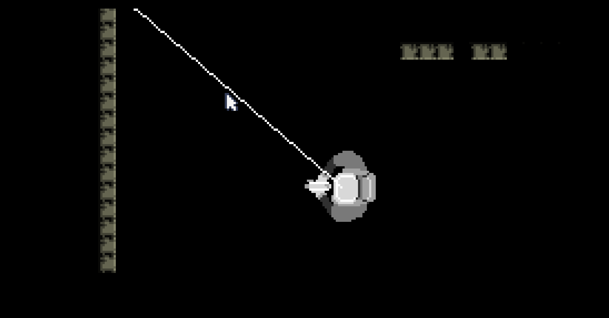

## Duck Hunter

      

### What I worked on:

 - Creating the game concept and loop, as well as the prototype project presented.

### Project Information:

 - Tools - Processing, Aseprite
 - Languages - Java
 - Project Management - Git

### Downloads:

 - Download Duck Hunter on GitHub [here](https://github.com/migdantas/Duck_Hunter).
 - Download Processing [here](https://processing.org/).

## Smiley Catch

A micro-game proof of concept, developed as a way to challenge myself to learn how to implement wander, flee and persue AI behaviours.

### What I worked on:

 - Creating the game concept and loop, as well as the prototype project presented.

### Project Information:

 - Tools - Unity, Aseprite
 - Languages - C#
 - Project Management - Git

### Downloads:

 - Download Smiley Catch [here](https://migdantas.itch.io/smileycatch).
 - Check the project on GitHub [here](https://github.com/migdantas/Smiley_Catch).

## Space Darkness

### What I worked on:

 - Creating the game concept and mechanics as well as implementing the shooting and rotating mechanics.

### Project Information:

 - Tools - TIC-80
 - Languages - Lua
 - Project Management - Git

### Project Partners:

 - António Mota
 - [Duarte Santos](https://duarte_santos.artstation.com/)
 - [Francisco Sarmento](https://franciscosarmento7.artstation.com/)
 - [Paulo Rodrigues](https://paulorodrigues12.github.io/)

### Downloads:

 - Play and Check the code for Space Darkness [here](https://tic80.com/play?cart=4132).
